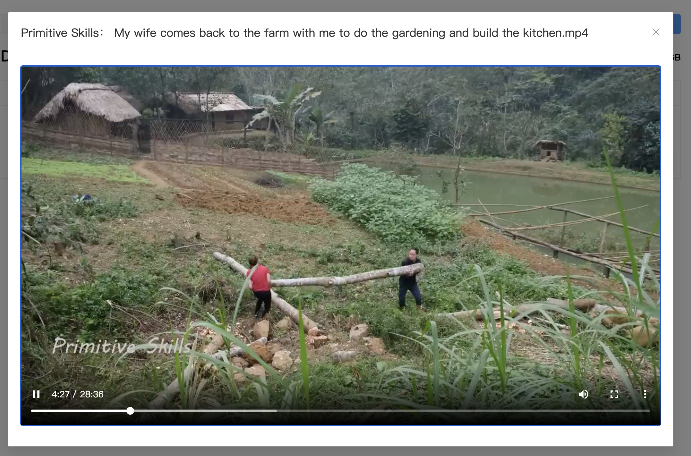

# youtube-dl-webui

A web client for youtube-dl

## Supported url types

1. video: https://www.youtube.com/watch?v=txxyjM5dXgw
2. channel: https://www.youtube.com/@PrimitiveSkillsnet/videos
3. playlist: https://www.youtube.com/watch?v=8ra4ezAbAoA&list=PLu5jI_OEKlo_dzfvxGXBJqE-IdYOx-HMA

## Start from docker image

```
docker run -d -p 8100:8100 \
  -v "$PWD/downloads":/root/downloads \
  -e AUTH_USER='demo' \
  -e AUTH_PASS='demo@321' \
  --name youtube-dl-webui hillwong/youtube-dl-webui:latest
```

## Basic Authentication

`AUTH_USER` and `AUTH_PASS` are used for basic authentication, if not needed, set it to an empty character

## Visit to webui

`http://$IP:8100/`

## Screenshot

webui


play online



