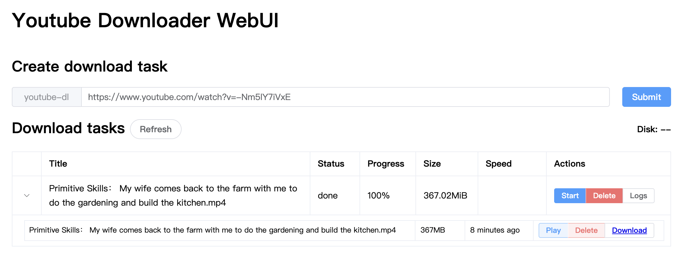

# youtube-dl-webui

## start from docker image

```
docker run -d -p 8100:8100 \
  -v "$PWD/downloads":/root/downloads \
  -e AUTH_USER='demo' \
  -e AUTH_PASS='demo@321' \
  --name youtube-dl-webui youtube-dl-webui:latest
```

## visit to webui

`http://$IP:8100/`

## screenshot


